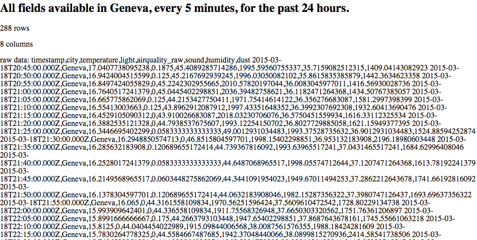
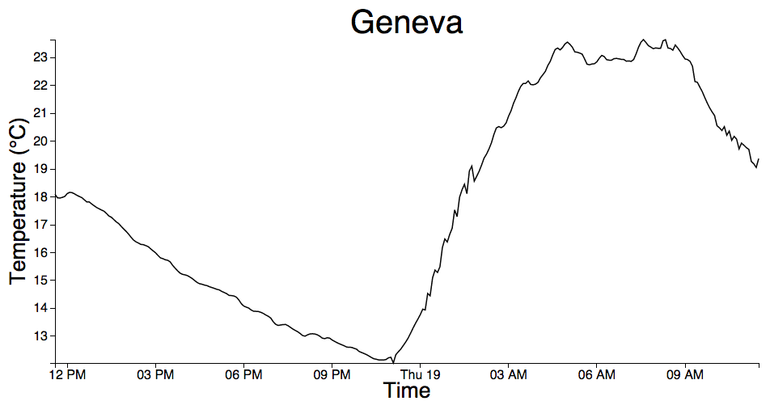
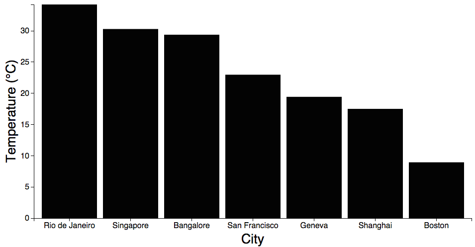
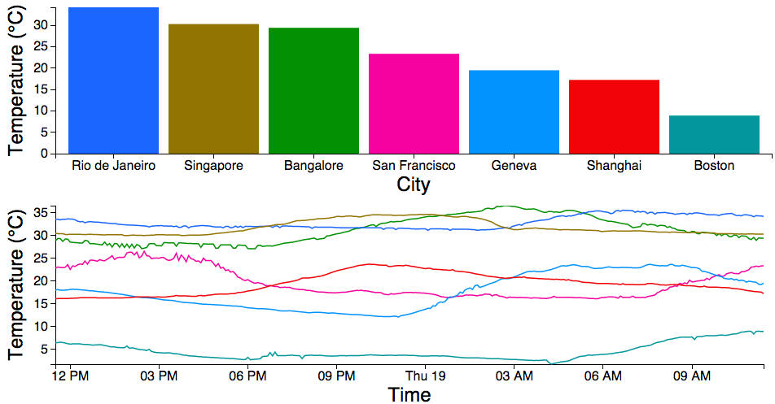
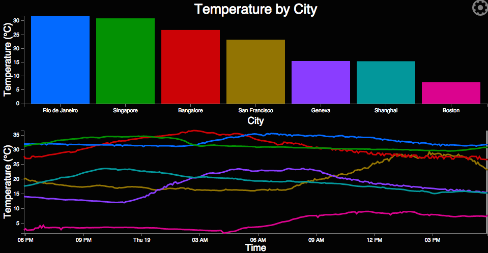
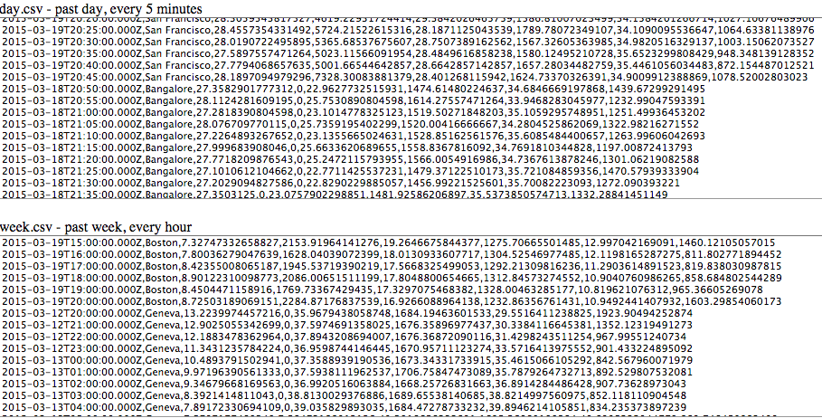
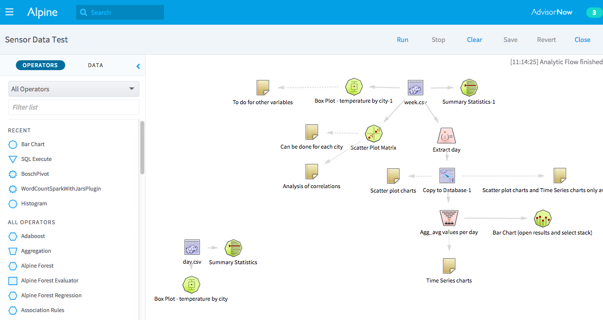
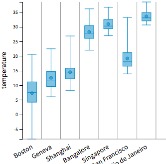
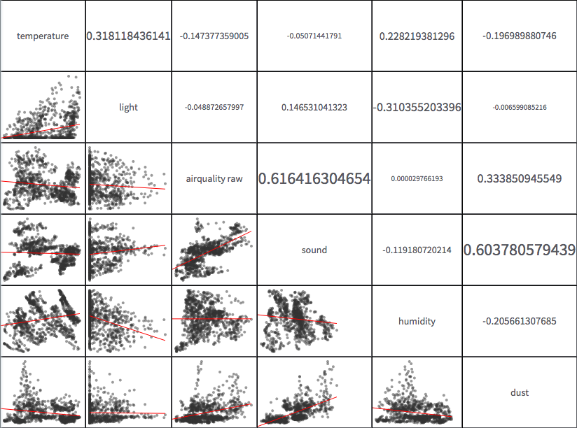
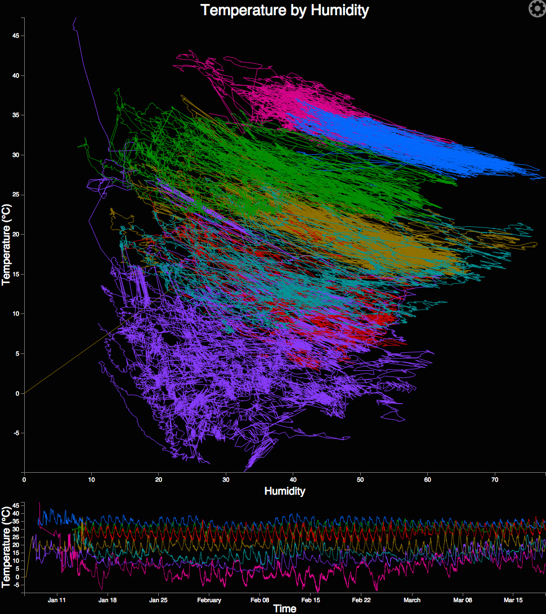

# data-art-challenge

This document is a submission for the [Sense Your City Data Art Challenge](http://datacanvas.org/sense-your-city/), by Curran Kelleher and Emilie de Longueau of [Alpine Data Labs](http://alpinenow.com/).

The first step of our process was to fetch the data with simple API use. This is what we saw when querying for temperature data in Geneva with a resolution of 5 minutes over the past 24 hours.

| |
|:---------------:|
|[The raw data, "visualized" as text.](http://bl.ocks.org/curran/5f255332a9dcb9906f84)|

Using the data returned from the API in conjunction with a D3 Line Chart module developed as part of the [ModelJS project](), we created the following simple visualization. Clicking the link will show you up-to-date data, and will automatically update every 5 minutes. if you [run the visualization full screen](http://bl.ocks.org/curran/raw/015402cce2caa074551e/), it will automatically resize to fill the window.

| |
|:---------------:|
|[24 hours of temperature in Geneva.](http://bl.ocks.org/curran/015402cce2caa074551e)|

Since the API only supports accessing data for a single city at a time, we used [async.js](https://github.com/caolan/async) to manage asynchronous control flow for fetching data for multiple cities (using separate API calls) then merging the result. With this approach we were able to visualize temperature for many cities in the following bar chart.

| |
|:---------------:|
|[Current temperature in all available cities.](http://bl.ocks.org/curran/015d34d6d3d562877e51)|

Combining the first two visualizations and color coding marks by city yields the following visualization dashboard with a bar chart and line chart. The colors here were [picked automatically](http://bl.ocks.org/curran/dd73d3d8925cdf50df86).

| |
|:---------------:|
|[24 hours of temperature for all available cities.](http://bl.ocks.org/curran/3b811f05a0ce39d0d7cd)|

At Alpine, we are working on a new interactive visualization runtime environment called [Chiasm](https://github.com/curran/chiasm). We thought this data set would be a good test of the system. Here is an interactive variation on the time line and bar chart combination.

| |
|:---------------:|
|[Visualization using Chiasm.](http://bl.ocks.org/curran/5a9767b5c23982c89632)|

The gear icon lets you open the configuration editor. Click on numbers and colors in the configuration editor for interactive widgets that let you configure the visualizations. For example, you can edit the color scale used by both visualizations, or edit the title text. Hovering over the line chart causes the bar chart to display data for the selected slice of time only (using [Crossfilter](http://square.github.io/crossfilter/)). A black background is used to reduce energy use if this visualization were to be displayed for a long period of time.

We wanted to try analyzing this data using [Alpine](http://alpinenow.com/). To do this, the data was first extracted into CSV format, then imported into a Hadoop file system.

| |
|:---------------:|
|[A CSV data dump.](http://bl.ocks.org/curran/c65ce9880826e466d2b0)|

The following analysis and visualizations were created using by Emilie de Longueau using Alpine. 

||
|:---------------:|
|The Alpine workflow that produced the visualizations.|

||
|:---------------:|
|A box plot of temperatures for each city over the past month.|

||
|:---------------:|
|A scatter plot matrix revealing interesting patterns.|

The intriguing patterns that appeared in the scatter plot matrix indicate that there are clusters in the data. We suspected these clusters were cities, and that each city has its own multidimensional "fingerprint". One interesting combination of fields in the scatter plot matrix is temperature vs. humidity. We created the following visualization to confirm our hypothesis that the clusters represent cities. Color represent city. This visualization fetches data at a resolution of 5 minutes in 24 hour chunks. It continually fetches data going back in time, one day at a time.

| |
|:---------------:|
|[A scatter plot with lines.](http://bl.ocks.org/curran/a274af1f64dff25ceca1)|

This visualization is an extension of the scatter plot idea with lines. Lines connect points that are adjacent in time. This visualization shows that cities do form clusters in the (temperature, humidity) space, and each has their own unique shape. This visualization also reveals how far back the data goes. It looks like glitch-free data collection began around January 15, 2015. Before this time, one can see anomalies on the data, indicating initial issues with sensor setup.
